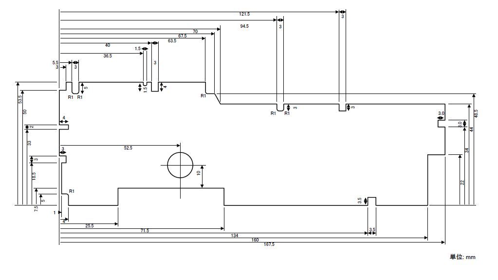
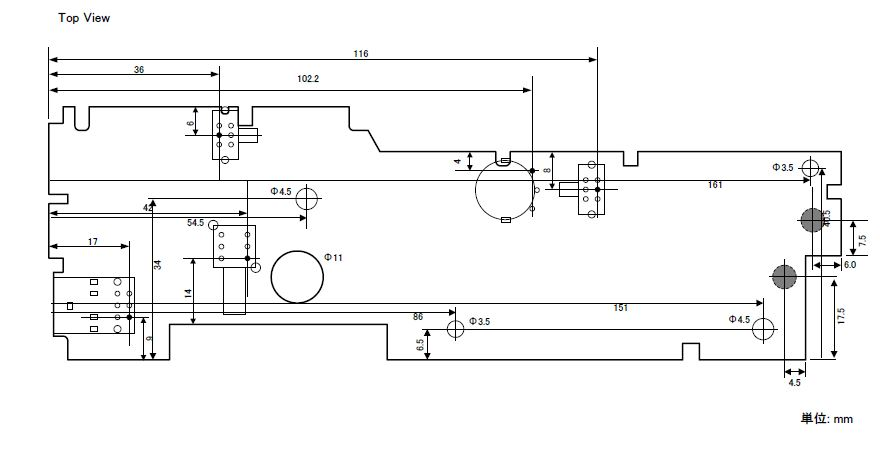
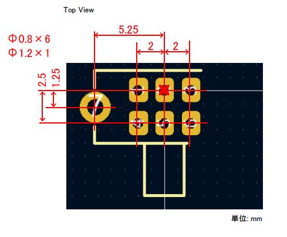
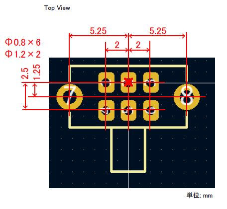
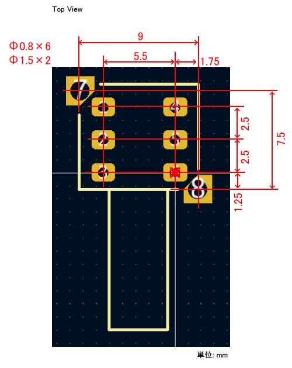
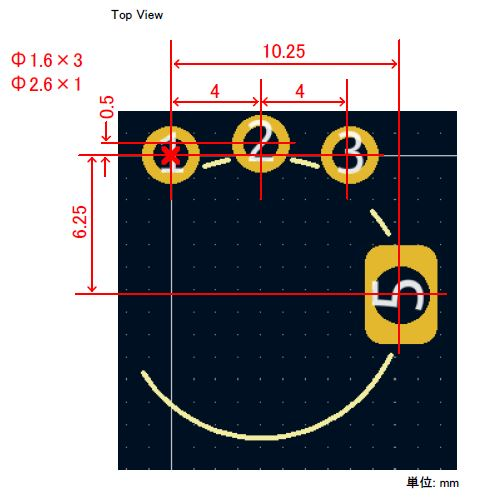
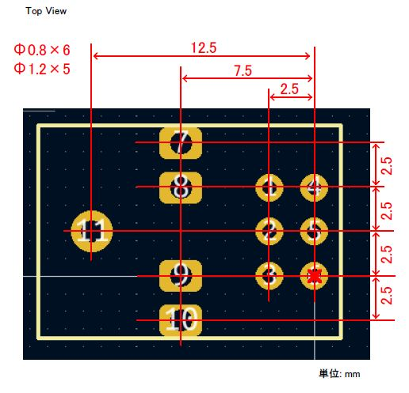
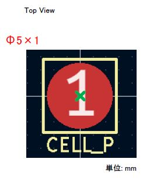
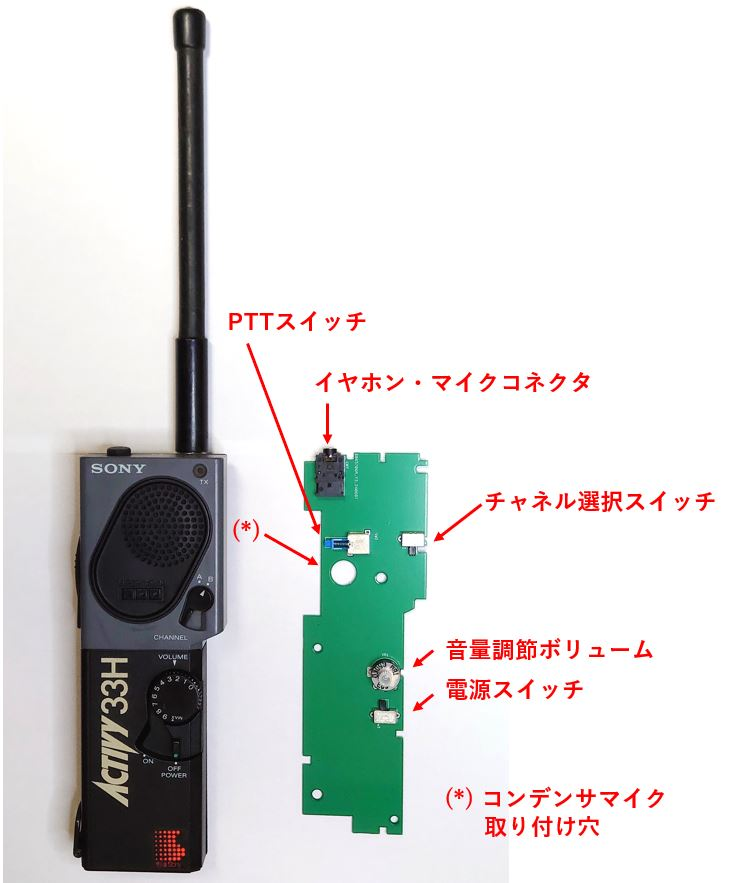
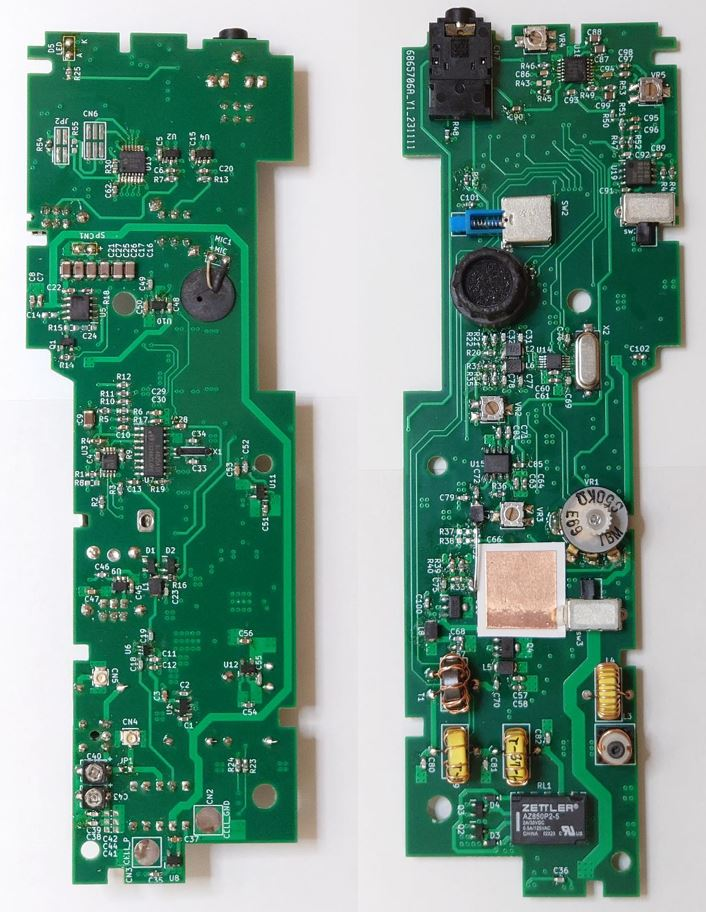

## タイトル  
市民ラジオトランシーバー  ICB-33Hの筐体に入る基板  

## はじめに
ICB-33Hの筐体に入る基板を設計したので、情報を公開します。
ICB-33Hは1980年代から1990年代にかけて販売されていたソニー製の市民ラジオのトランシーバーです。  
  
中身を入れ替えることで、新たな市民ラジオのトランシーバーを製作したり、周波数の近い28MHz帯の
アマチュア無線のトランシーバーを製作することができます。
  
本書では設計した基板の外形寸法、スイッチやボリュームなど筐体にとりつく部品の配置、部品の高さ制限の情報などを示します。

## 外形寸法
基板の外形寸法を以下に示します。

[outline_drawing.pdf](./pdf/outline_drawing.pdf)  
  

## ドリル・部品配置
ドリルおよび部品配置の情報を以下に示します。
取り付け穴は全部で4つです。
電池接続パッドは半田面に配置します。それ以外の部品は全て部品面に配置します。

[drill_and_components_layout.pdf](./pdf/drill_and_components_layout.pdf)  
  

## 高さ制限
部品面、半田面の高さ制限の情報を以下に示します。
スイッチやボリュームと連動する機構部品や、スピーカーなどと干渉するため、部品の高さ制限や配置禁止領域があります。

* 部品面  
[height_limit(component_side).pdf](./pdf/height_limit(component_side).pdf)  
.jpg)  
* 半田面  
[height_limit(solder_side).pdf](./pdf/height_limit(solder_side).pdf)  
.jpg)  

## 部品
部品取り付け穴の情報を示します。
マイク・イヤホンジャックの部品は位置決め用の樹脂製のボスがありますが、下図には記載していません。ボスを切除してしまうか、
基板に穴を追加する必要があります。

[components.pdf](./pdf/components.pdf)  
* チャネル選択スイッチ  
  
* 電源スイッチ  
  
* PTTスイッチ  
  
* 音量調節ボリューム  
  
* イヤホン・マイクコネクタ  
  
* 電池接続パッド  
  

## 実装
基板に部品を実装した様子を示します。
ボリュームの取り付け位置がシビアです。ボリュームの取り付け穴は大きめに設計してあり、遊びを設けてあります。
筐体に基板を組付けてボリュームの取付位置を決めてから、残りの部品を取り付けるとうまくいきます。

  
  

## その他 設計情報
上記で示した基板のガーバーデータ、KiCAD データを示します。KiCADはバージョン6.0です。

[gerbers](./gerbers)  
[KiCAD](./KiCAD)  

## 作例
この基板を用いて市民ラジオのトランシーバーを製作し、技適を受けることができました(120mW, 2ch機)。
試験的な交信はできています。
ホイップアンテナは筐体上部にねじ止めされていますが、この部分と基板を電気的にどのように接続するかが難しいところです。

   

